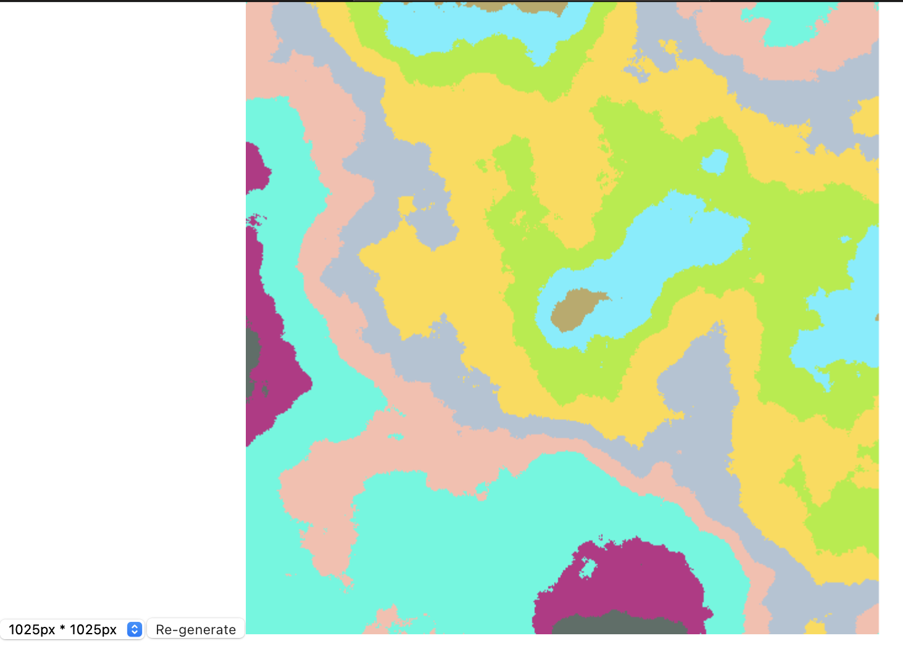

# Utilities website for Table top RPG

Hi, this repository is a personal project of mine.
It aims to be a fully tested React website, that contains
some cool utilities for tabletop RPG players and Game Masters.

## Idea behind
I'm doing this project because I always have to go to different websites
to find what I want for my games. I wanted to have a single one that has
everything I need.

I'm also very interested in learning how all those tools are created, so
I'm building them rather than just linking to some other website.

I want this to be usable by anyone, and I also intend to use it to progress
in my Software Engineering skills.

## Progress
It's at a very early stage at the moment, but you can follow progress and ideas here:

https://trello.com/b/WSuICqBG/ttrpg-utils

Latest update: Map generator with size selector. UI in progress

## Usage
`$ yarn && yart start`
